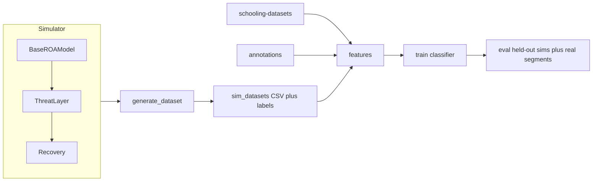

# Fish School Simulation + Motion Classifier

## Decisions (locked)

- **Scope:** full pipeline — simulator, dataset generation, features, classifier, train/eval
- **Locomotion:** continuous bounded acceleration (not burst-and-coast)
- **Volume:** 100 simulations per class, for each \(N \in \{10,20,30,40,100,200\}\) → **3600** trajectories
- **Classes (canonical):** `traveling_polarized`, `milling`, `shoaling`, `fountain_evasion`, `expansion_burst`, `compaction` (aliases via existing [`annotations/_label_aliases.json`](annotations/_label_aliases.json); add `compaction` / `spread`→`expansion_burst`)

## Existing assets to reuse

- Real trajectories: [`schooling-datasets/{10,30,70,150}_fish/*/_*_loc_vel_data.csv`](schooling-datasets/) — columns `frame,fish{i}_x,fish{i}_y,fish{i}_vx,fish{i}_vy`, ~30 fps
- Segment labels: [`annotations/*_motion.json`](annotations/) — `mm:ss` segments; real label counts are skewed (polarized≫milling≫shoaling; fountain/burst rare; **no compaction**)
- Meta: [`annotations/datasets.json`](annotations/datasets.json) (`fps`, fish group)

Sim outputs must match the real CSV schema so the same feature code runs on both.

## Architecture



### Core model (`src/sim/`)

Per fish: position \(\mathbf{x}_i\), heading \(\theta_i\), speed \(s_i\), state \(q_i\).

- **Motion:** \(\dot{\mathbf{x}}_i = s_i \mathbf{h}_i\) (optional weak current later; default off)
- **Speed:** \(\dot{s}_i = \mathrm{clip}((s^*(q_i)-s_i)/\tau_s, -a_{\max}, a_{\max})\)
- **Turning:** weighted repulsion / orientation / attraction / wall / predator + noise, clipped by \(\omega_{\max}\)
- **Neighborhoods:** first-shell Voronoi (SciPy), with distance/angle weights and rear blind spot
- **Arena:** circular or rectangular soft walls sized to approximate real pixel extents (~700–1500 × 500–1000); scale body length / preferred spacing so order parameters match real Tunstrøm-style signatures

**Baseline parameter sets** (frozen YAML under `configs/behaviors/`):

| Class | Regime |
| ----- | ------ |
| Tpol | high \(w_O\), moderate \(w_A\), hard short \(w_R\), low noise, higher cruise speed |
| M | stronger \(w_A\), moderate–high \(w_O\), finite \(\omega_{\max}\), compact init / mild confinement; ~20% bidirectional via opposite circulation bias + reduced cross-stream alignment |
| S | cohesion \(w_A\), weak \(w_O\), lower speed, moderate noise |
| F | start polarized; predator crosses; Bartashevich-style flee with \(\Delta\alpha\sim 30^\circ\)–\(45^\circ\); \(w_P\gg\) social but residual attraction for reunion |
| E+ | brief startle: speed impulse, raise \(w_R\), weaken \(w_A,w_O\); excitable \(z_i\) cascade to neighbors |
| E− | temporary reduction of preferred spacing \(d_0\); keep local (not global centroid) forces |

State machine: `baseline → alert|fountain|startle|compact → recover → baseline`, with probabilistic sigmoid switching on predator distance / looming / startled neighbors.

### Dataset generation (`scripts/generate_sims.py`)

- For each `(behavior, N, seed)`: burn-in → record \(T\) frames at 30 fps (default ~15–30 s useful window; threat events mid-clip for F/E+/E−)
- Write:
  - `sim_datasets/{behavior}/N{n}/seed{k}_loc_vel_data.csv` (same schema as real)
  - `sim_datasets/{behavior}/N{n}/seed{k}_motion.json` (full-clip or event-window label)
  - `sim_datasets/manifest.json` (behavior, N, seed, path, validation metrics)
- Hold out **20% of seeds** per (behavior, N) for test; rest train/val
- Soft validation gate: reject/retry if per-behavior signatures on \(\Phi_{\mathrm{dir}},\bar L,\Phi_{\mathrm{rot}},\Phi_{\mathrm{tan}},\bar v_r,\sigma_d\) fail; log pass rate in manifest

### Features (`src/features/`) — locked set

These six order parameters are the **only** classifier inputs (no extra NND/density/speed features in v1). Computed per frame from positions/velocities, then aggregated over sliding windows (mean, std, and for \(\bar v_r\) also signed trend / \(d\sigma_d/dt\) within the window).

For each fish \(i\): unit velocity \(\hat{\mathbf v}_i=\mathbf v_i/\|\mathbf v_i\|\), relative position \(\mathbf r_i=\mathbf x_i-\bar{\mathbf x}\), centroid \(\bar{\mathbf x}\).

1. **Directional polarization** \(\Phi_{\mathrm{dir}}=\|\langle\hat{\mathbf v}_i\rangle\|\)
   - ~0 disordered; ~1 globally aligned (Tpol high; S low)
2. **Normalized angular momentum** \(\bar L=\langle L_i\rangle/\langle\|\mathbf r_i\|\rangle\) with \(L_i=r_{i,x}v_{i,y}-r_{i,y}v_{i,x}\)
   - ~0 no organized circular flow; large |value| unidirectional mill
3. **Rotational polarization** \(\Phi_{\mathrm{rot}}=|\sum_i L_i|/\sum_i|L_i|\)
   - (equiv. form of \(\langle\|\sum L_i\|\rangle/\langle\sum\|L_i\|\rangle\) over the school)
   - ~1 uni-directional mill; ~0 no rotation or balanced bidirectional mill
4. **Tangential order** \(\Phi_{\mathrm{tan}}=\langle|\hat{\mathbf v}_i\cdot\hat{\mathbf t}_i|\rangle\) with \(\hat{\mathbf t}_i=(-r_{i,y},r_{i,x})/\|\mathbf r_i\|\)
   - ~1 orbiting; ~0 pure radial expansion/contraction
5. **Mean radial velocity** \(\bar v_r=\langle\hat{\mathbf v}_i\cdot\hat{\mathbf r}_i\rangle\) (signed)
   - Implement **signed** \(\langle\cos\psi_i\rangle\) so E+ (\(\bar v_r>0\)) and E− (\(\bar v_r<0\)) separate; the writeup’s \(\langle\|\cos\psi_i\|\rangle\) would lose sign and is not used
6. **Spread** \(\sigma_d=\mathrm{std}(\|\mathbf r_i\|)\)
   - tight vs elongated/loose aggregation; rises in E+/F, falls in E−

**Behavior signatures (validation + expected classifier cues):**

- Tpol: high \(\Phi_{\mathrm{dir}}\), low \(|\bar L|\), low \(\Phi_{\mathrm{rot}}\) or irrelevant, moderate \(\Phi_{\mathrm{tan}}\), \(\bar v_r\approx 0\), stable \(\sigma_d\)
- M (uni): moderate/low \(\Phi_{\mathrm{dir}}\), high \(|\bar L|\), high \(\Phi_{\mathrm{rot}}\), high \(\Phi_{\mathrm{tan}}\), \(\bar v_r\approx 0\), stable \(\sigma_d\)
- M (bi): low \(\Phi_{\mathrm{dir}}\), \(\bar L\approx 0\), low \(\Phi_{\mathrm{rot}}\), high \(\Phi_{\mathrm{tan}}\), stable \(\sigma_d\)
- S: low \(\Phi_{\mathrm{dir}}\), low \(|\bar L|\), low \(\Phi_{\mathrm{rot}}\), low–moderate \(\Phi_{\mathrm{tan}}\), \(\bar v_r\approx 0\), stable \(\sigma_d\)
- F: transient drop in \(\Phi_{\mathrm{dir}}\), \(\sigma_d\) rise then recovery; \(\Phi_{\mathrm{tan}}\) / \(\bar v_r\) fluctuate during split
- E+: \(\bar v_r>0\), \(\sigma_d\) rising, \(\Phi_{\mathrm{tan}}\) drop
- E−: \(\bar v_r<0\), \(\sigma_d\) falling

Real segments: load CSV + [`annotations/*_motion.json`](annotations/), map aliases, compute the same six series, aggregate over the segment (and/or short windows). Skip segments that are too short.

### Classifier (`src/classify/`)

- Start with a strong tabular baseline: **gradient boosting** (LightGBM/sklearn HistGradientBoosting) on window/segment feature vectors — fast, interpretable, good with 3600 sims
- Optional sequence head later (not required for v1): small 1D CNN/Transformer on feature time series
- Train on sim train split only
- Evaluate:
  1. Held-out sim test (all 6 classes)
  2. Real annotated segments (5 classes present; compaction N/A — report separately / exclude from real metrics)
- Metrics: accuracy, per-class F1, confusion matrix; save under `results/`

### CLI / layout

```
src/sim/{model,neighbors,threat,metrics,io}.py
src/features/{order_params,windows,dataset}.py  # order_params = Φdir, L̄, Φrot, Φtan, v̄r, σd
src/classify/{train,eval}.py
configs/behaviors/{tpol,milling,shoaling,fountain,expansion,compaction}.yaml
scripts/{generate_sims,calibrate_baselines,train_classifier,eval_real}.py
sim_datasets/   # generated
results/
requirements.txt
README.md
```

## Implementation sequence

1. **Scaffold + IO** — CSV/JSON writers matching real schema; label canonicalization
2. **Base ROA simulator** — Voronoi neighbors, walls, continuous speed/heading; unit smoke tests for cohesion
3. **Calibrate Tpol / M / S** — sweep weights until \(\Phi_{\mathrm{dir}},\bar L,\Phi_{\mathrm{rot}},\Phi_{\mathrm{tan}},\bar v_r,\sigma_d\) signatures hold; freeze YAMLs; include bidirectional milling variant
4. **Threat layer** — F, E+, E− + recovery; event scheduling in generator
5. **Bulk generate** — 3600 sims with validation filters and train/test seed split
6. **Features + classifier** — compute the six order params; train GB on sim; eval held-out sim + real annotation segments
7. **Report** — confusion matrices, class F1, notes on real-data class imbalance / missing compaction

## Risks / mitigations

- **Real↔sim domain gap:** calibrate speeds/spacing to real pixel stats (mean speed ~0.7 px/frame on sample 0124); same feature pipeline on both
- **Rare real labels** (fountain/burst): real eval will be sparse — primary quantitative claim is sim test; real is secondary sanity check
- **No real compaction:** train/eval compaction on sims only; do not score compaction on real set
- **Scale (N=200 × 3600):** vectorize with NumPy; Voronoi is the bottleneck — cache per-frame neighbor graphs; allow `--n-jobs` parallel generation
